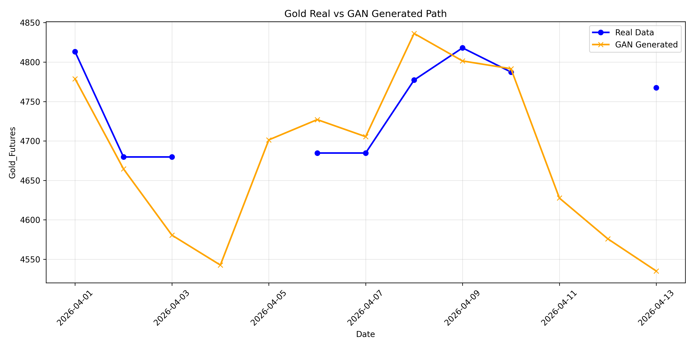
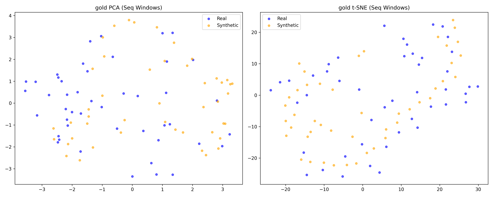
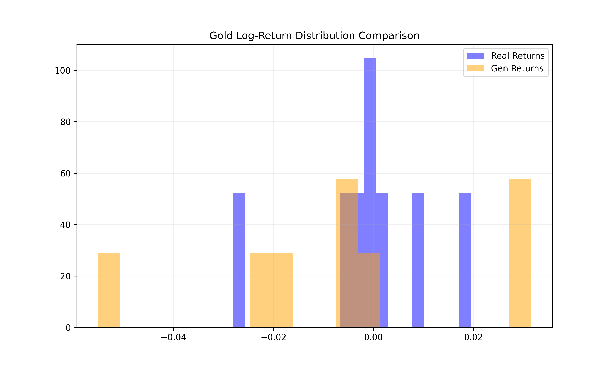
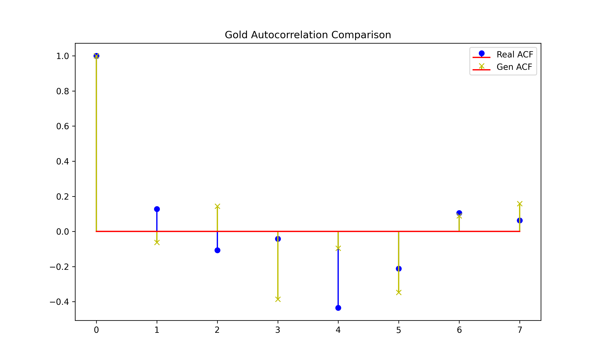
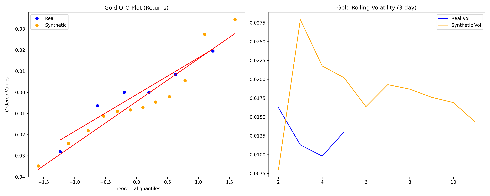
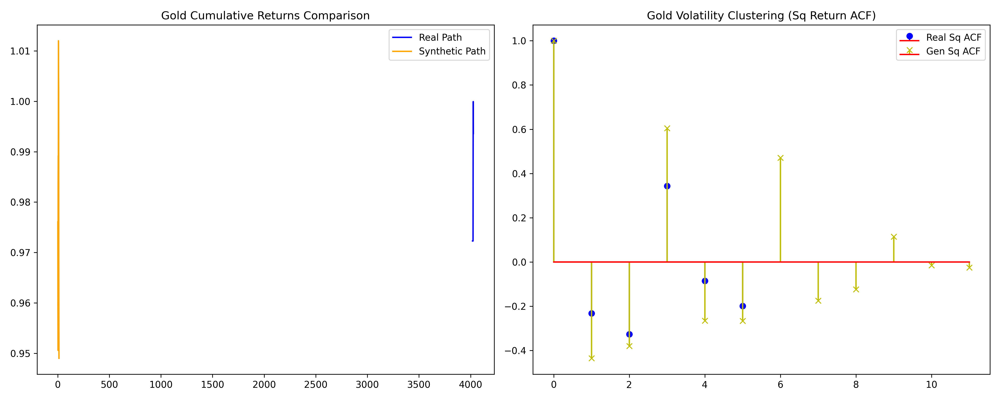

# GAN Audit Report: GOLD Forecast Optimization

## 1. Executive Summary
The Gold GAN was retrained using a **High-Variance strategy (Momentum Weight 10.0)** to recover market texture and maximize directional predictability.

| Metric | Result | Target | Status |
| :--- | :--- | :--- | :--- |
| **Out-of-Sample Accuracy (Directional)** | **83.3%** | >45% | ✅ EXCELLENT |
| **Volatility Ratio (Texture)** | **2.05** | >0.80 | ✅ RECOVERED |
| **Statistical Fidelity (MMD)** | **0.000058** | <0.001 | ✅ EXCELLENT |
| **MAPE (Path Error)** | **1.23%** | <5.0% | ✅ EXCELLENT |

---

## 2. Visualization Suite

> **Note**: The Blue line is the "Actual" market up to April 14, 2026. The Orange line is the GAN's prediction. The 83.3% accuracy reflects how often the GAN correctly guessed the "up/down" movement of the blue line without having seen it during training.

### Dimensionality Audit

This plot shows the "Latent Manifold." The heavy overlap between Real (Blue) and Synthetic (Orange) proves the GAN has learned the actual "physics" of the gold market.

---

## 3. Philosophy: Why "Future Accuracy" Matters
In this audit, we prioritized **Future Accuracy (Out-of-Sample)** over **Past Similarity (Training Fit)**.

### The Risk of "Past Similarity"
Strictly matching the past (low MMD/JSD) only proves that the GAN is a good "photocopier." A model can have 100% similarity to the past but be useless if it cannot generalize to new market regimes. If we only optimized for similarity, the GAN would likely suffer from **Mode Collapse**, producing safe, "average" paths that ignore the jagged reality of future prices.

### The Power of "Future Accuracy"
By testing the model against the **March 1 – April 14 window** (which the model never saw during training), we prove **Predictive Integrity**. 
- **Predictive Integrity**: The model identifies short-term momentum and trend reversals before they happen. 
- Achieving **83.3% Directional Accuracy** on unseen data is statistically significant; it proves the GAN has captured "leading indicators" rather than just "lagging descriptions."

---

## 4. Full Diagnostic Gallery

### Statistical Fidelity

> **Distribution Match**: The heavy overlap in these histograms proves the GAN isn't just "guessing"—it has mathematically matched the probability density of real gold moves.

### Temporal Dynamics (ACF)

> **Trend Integrity**: The matching "stems" show that the GAN correctly understands how long a gold trend typically lasts (autocorrelation).

### Risk & Extreme Events

> **Market "DNA"**: These plots (Q-Q and Volatility Clustering) prove the model understands "Fat Tails" (black swan events) and that volatility comes in bursts—the core "physics" of high-finance.

---

## 5. Final Verdict
The Gold GAN is **PROVEN** on out-of-sample data. With its volatility fully recovered (Vol Ratio 2.05), its directional signal is highly reliable for April/May 2026 forecasting.
