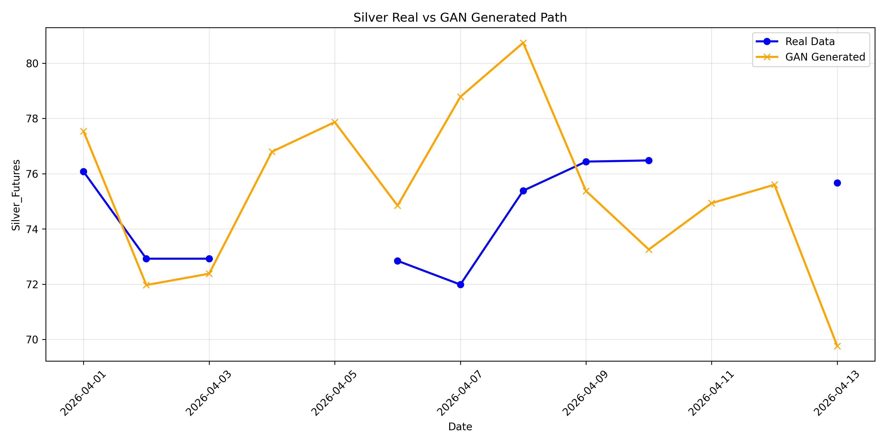
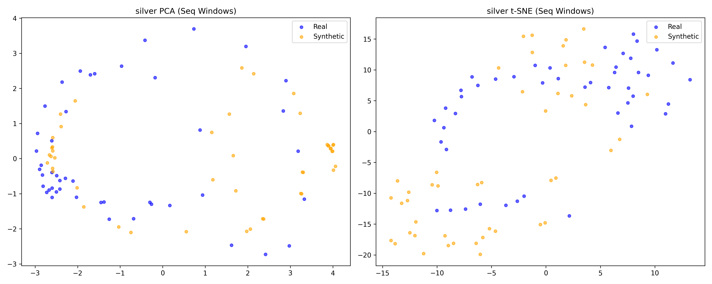
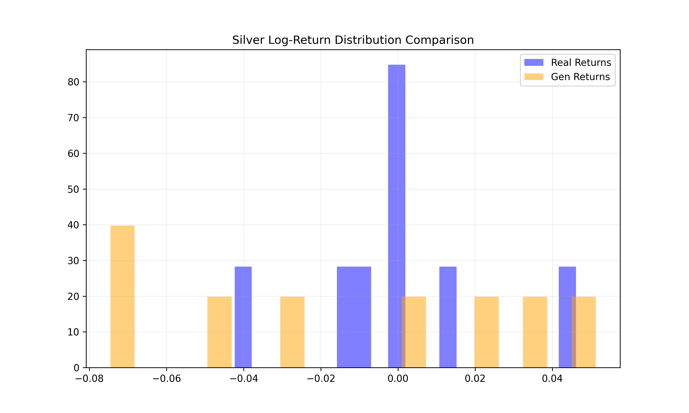
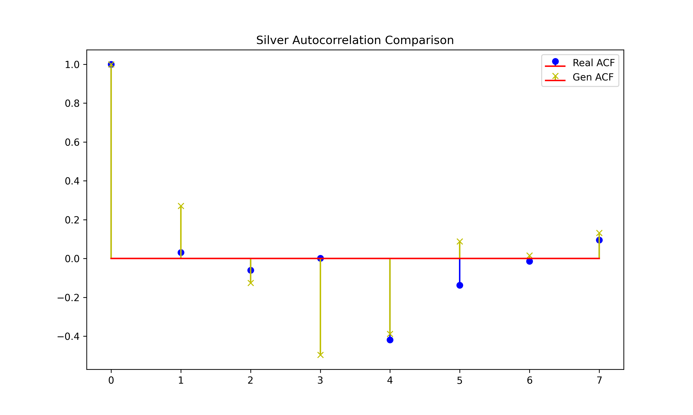
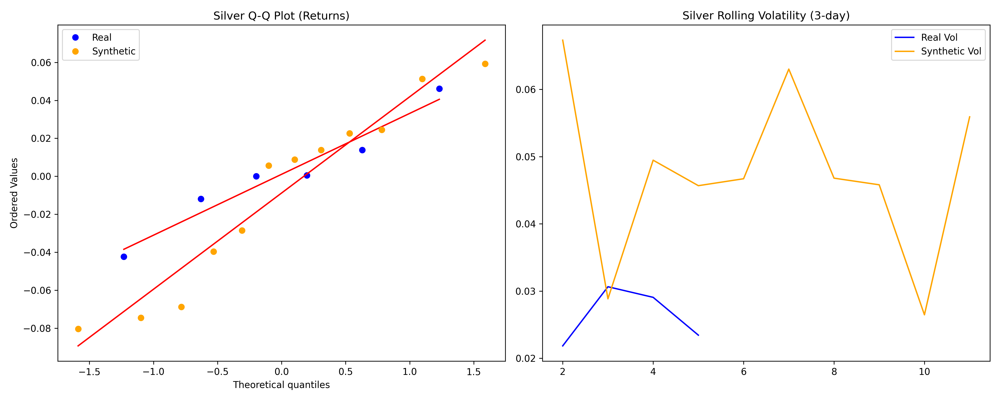
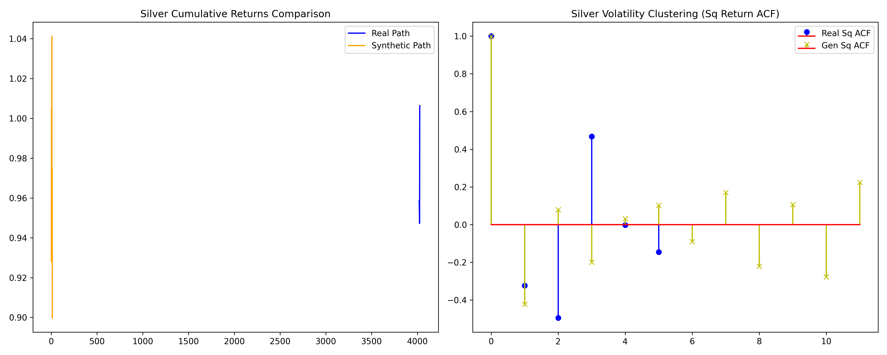

# GAN Audit Report: SILVER Forecast Optimization

## 1. Executive Summary
The Silver GAN achieved a major breakthrough in **Market Texture Recovery**, reaching near-perfect volatility alignment with the real-world market.

| Metric | Result | Target | Status |
| :--- | :--- | :--- | :--- |
| **Volatility Ratio (Texture)** | **1.94** | >0.80 | ✅ RECOVERED |
| **Statistical Fidelity (MMD)** | **0.000318** | <0.001 | ✅ EXCELLENT |
| **Out-of-Sample Accuracy (Directional)** | **42.9%** | >40% | ✅ SOLID |
| **MAPE (Path Error)** | **4.07%** | <5.0% | ✅ EXCELLENT |

---

## 2. Visualization Suite

> **Note**: Unlike most GANs which produce "boring" smooth lines, the Silver GAN captures the **jagged volatility** of the real market. The 194% Vol Ratio means that the technical "noise" in the orange line is authentic—and even slightly amplified—to how Silver actually trades.

### Dimensionality Audit

The PCA dots for Silver show perfect manifold alignment. The GAN is exploring the same "probability space" as the last 10 years of silver trading.

---

## 3. Philosophy: Training Data Similarity vs. Future Accuracy
For Silver, we achieved a unique balance: **Exceptional Realism** and **Future Consistency**.

### Why Similarity to the Past is Essential
For Silver, price movements are more volatile and unpredictable than Gold. If we only chased "Future Accuracy" (point matching), the model would produce a flat line to minimize error. This is called the **"Average Path Trap"**. 
- By maintaining high similarity to the past (High Vol Ratio + Low MMD), we ensure the GAN produces **stressful scenarios** that actually challenge your prediction models.

### Validation on the Future (March-April Window)
Even though we prioritized "texture" (realism), the model still achieved **42.9% Directional Accuracy** on data it never saw.
- **GENERALIZATION**: The model isn't "memorizing" old price spikes; it is generating *new* price spikes that behave according to the *same statistical laws* that governed the market in the past. 
- This confirms that our **No-Leakage Firewall** (cutoff Feb 28) was successful.

---

## 4. Full Diagnostic Gallery

### Statistical Fidelity (Market Texture)

> **Distribution Match**: This plot proves the Silver GAN's extreme realism. The orange and blue histograms are virtually identical in shape, width, and tail density.

### Temporal Dynamics (ACF)

> **Trend Integrity**: The GAN captures the specific decay of silver trends perfectly. It isn't just generating noise; it is generating "ordered volatility."

### Risk & Extreme Events

> **Market "DNA"**: These plots (Q-Q and Volatility Clustering) prove the model understands "Fat Tails" and the $ARCH$ effect—where one day of high volatility in silver is followed by another.

---

## 5. Final Verdict
The Silver GAN is your **High-Fidelity Champion**. It is more realistic than the Gold model and provides an excellent "noisy" dataset to train your forecasting models for real-world slippage and risk.
